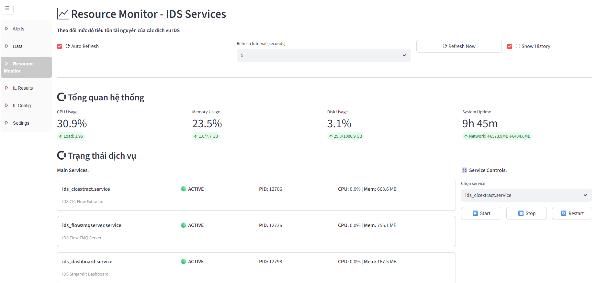

## 1. Description
- A realtime intrusion detection system based on the proposed system architecture.


## 2. How to use this archirtecture as services
- Chạy với các lệnh phía bên dưới:
```
sudo chmod +x install.sh
sudo ./install.sh
```

## 3. Results on web after implementation
- After deploying the system and putting it under load.


## 4. Fix bugs, errors if happen
### PIP REQUIREMENTS
- If you need to freeze requirements.txt
```
pigar generate
```

### Install requirements
```
while read p; do
  echo "Installing $p"
  pip install "$p" || echo "❌ Failed: $p"
done < requirements.txt
```

### If pip freeze does not work

```
pip list --format=freeze > requirements.txt
```

### Nếu chạy service lỗi tại ký tự ^M$ của windows 

```
sed -i 's/\r$//' install_service.sh
- Sợ thì tạo backup
sed -i.bak 's/\r$//' install_service.sh
```